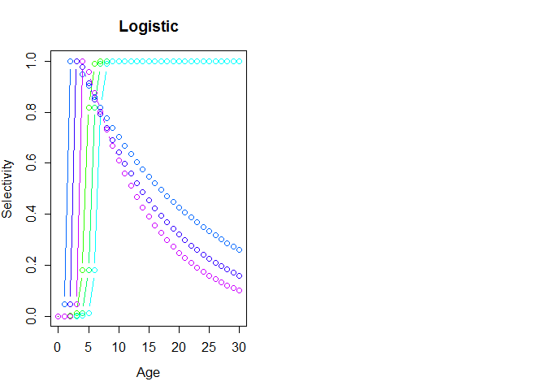
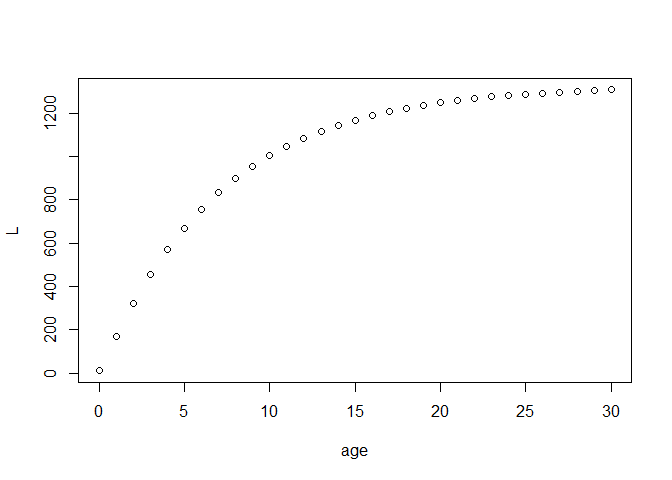

Written by Henning Winker <br> <henning.winker@gmail.com>

To add flexibility for exploring alternative assumptions about selectivity, JABBA-Select provides the user an option to specify a 5-parameter piece-wise dome-shaped selectivity curve, with a logistic function for the ascending limb and the descending limb described by the mean and CV of a half-normal distribution (Huynh et al., 2018)

This little tutorial R code illustrates how to approximate the 5-parameter for JABBA-Selex function from various selection-at-length(age) relationships. To do this, we use the `jabba.selex()` function shown below.

``` r
#--------------------------------------
# JABBA-Selex function
#--------------------------------------

jabba.selex <- function(pars,dat){
  L = dat[,1]
  sel = dat[,2]/max(dat[,2])
  SL50  = pars[1]
  SL95  =  pars[2]
  SL.desc =  pars[3]    
  CV.desc   =  pars[4]
  min.desc =     pars[5]
  psel_a = 1/(1+exp(-log(19)*(L-SL50)/(SL95-SL50)))
  psel_b = dnorm(L,SL.desc,CV.desc*SL.desc)/max(dnorm(L,SL.desc,CV.desc*SL.desc))
  psel_c = 1+(min.desc-1)*(psel_b-1)/-1
  psel = ifelse(L<SL.desc,psel_a,psel_c)
  resids = sel-psel
  return(list(ll=sum(resids^2),results=data.frame(L=L,obs=sel,fit=psel,logis=psel_a,halfnorm=psel_b,height=psel_c)))
}
# Likelihood
jsel.ll = function(pars,dat){
  jabba.selex(pars,dat)$ll
} 
```

Punt and Japp (1994) delevoped an Age-Structured Production Model for South African Kinklip in which they considered altenative selectivity-at-age functions to model logistic and dome-shaped selectivity patterns of demersal longline and trawl fisheries, respectively. The selectivity-at-age of functions are given Appendix III by the equations AIII.1 and AIII.2 in Punt and Jupp (1994) and are combined here in the form the `selfun()`

``` r
#------------------------------------------------------------------------
# Piece-Wise Selectivity Function (Punt & Japp 1994)
selfun <- function(age,a50,delta,lamda){
logistic = 1/(1+exp(-(age-a50)/delta))  
dome = exp(-lamda*(age-a50))*logistic 
return(ifelse(age<a50,(logistic),(dome)/max(dome))) # selectivity-at-age
}
#------------------------------------------------------------------------
```

Because they expressed selectivity as function of age, we first convert age to length using the von Bertalanffy growth parameters in Punt and Jupp (1994).

``` r
#Growth paramters
Linf <- 1326
kappa <- 0.142
t0 <-  0.05
age = 0:30
L = Linf*(1-exp(-kappa*(age-t0)))
L[1] = 10
```

BLAH

``` r
# First 3 are logistic functions (lamda = 0) and second 3 dome-shaped
a50 = c(4.5,5.5,6.5,1.5,2.5,3.5)
delta = c(0.33,0.33,0.33,0.167,0.167,0.167)
lamda = c(0,0,0,0.05,0.07,0.09)


selex.dat = data.frame(L)
par(mfrow=c(1,2),mex=0.8)
cols= rainbow(10)
plot(0,0,ylim=c(0,1),xlim=c(0,30),ylab="Selectivity",xlab="Age",type="h",main="Logistic")
for(i in 1:6){ 
lines(age,selfun(age,a50[i],delta[i],lamda[i]),col=cols[3+i],type="b")
  selex.dat = cbind(selex.dat,Sel=selfun(age,a50[i],delta[i],lamda[i]))
}
# JABBA-Selex function
jabba.selex <- function(pars,dat){
  L = dat[,1]
  sel = dat[,2]/max(dat[,2])
  SL50  = pars[1]
  SL95  =  pars[2]
  SL.desc =  pars[3]    
  CV.desc   =  pars[4]
  min.desc =     pars[5]
  psel_a = 1/(1+exp(-log(19)*(L-SL50)/(SL95-SL50)))
  psel_b = dnorm(L,SL.desc,CV.desc*SL.desc)/max(dnorm(L,SL.desc,CV.desc*SL.desc))
  psel_c = 1+(min.desc-1)*(psel_b-1)/-1
  psel = ifelse(L<SL.desc,psel_a,psel_c)
  resids = sel-psel
  return(list(ll=sum(resids^2),results=data.frame(L=L,obs=sel,fit=psel,logis=psel_a,halfnorm=psel_b,height=psel_c)))
}
# Likelihood
jsel.ll = function(pars,dat){
  jabba.selex(pars,dat)$ll
} 


selex.pars = NULL
nSel = 6
# convert ss2jabba.selex
for(i in 1:nSel){
  
  # check maxima
  peak = which(max(selex.dat[,i+1])==selex.dat[,i+1])
  # get inits of jabba.selex parameters
  pars = c(SL50 = selex.dat[peak[1],1]*0.8,SL95=selex.dat[peak[1],1]*0.95,SL.desc=selex.dat[max(peak),1],CV.desc=0.2,min.desc=0.001)
  # Minimize
  jsel.est = optim(pars, fn = jsel.ll,method="L-BFGS-B",lower=10^-3,upper=max(selex.dat$L*1.1), dat = selex.dat[,c(1,i+1)], hessian = TRUE)
  #Results
  jsel.out = jabba.selex(jsel.est$par,dat=selex.dat[,c(1,i+1)])$results 
  selex.pars = cbind(selex.pars,round(jsel.est$par,4))
  

  # Plot
  if(i==1){
    Par = list(mfrow=c(round(nSel/2+0.01,0),ifelse(nSel==1,1,2)),mai=c(0.35,0.15,0,.15),omi = c(0.2,0.25,0.2,0) + 0.1,mgp=c(2,0.5,0), tck = -0.02,cex=0.8)
    #png(file = paste0("SELEX_",assessment,".png"), width = 7, height = ifelse(nSel==1,5,ifelse(nSel==2,3.,2.5))*round(nSel/2+0.01,0), 
    #    res = 200, units = "in")
    par(Par)
    }
  # Plot
  plot(jsel.out$L ,jsel.out$obs,type="p",pch=1,ylab="Selectivity",xlab="Length")
  lines(jsel.out$L,jsel.out$logis,lwd=2,col=4)
  if(jsel.est$par[3]<0.98*max(jsel.out$L))lines(jsel.out$L,jsel.out$halfnorm,lwd=2,col=3)
  if(jsel.est$par[3]<0.98*max(jsel.out$L)) lines(jsel.out$L,jsel.out$height,lwd=2,col=7)
  lines(jsel.out$L,jsel.out$fit,lwd=2,col=2)
  if(i==1)legend("right",c("ss3","Fit","Logistic","Half-Normal","Height"),pch=c(1,rep(-1,4)),lwd=c(-1,rep(2,4)),col=c(1,2,4,3,7),cex=0.8,bty="n")
  if(i == nSel){
    mtext(paste("Length"), side=1, outer=TRUE, at=0.5,line=1,cex=1)
    mtext(paste("Selectivity"), side=2, outer=TRUE, at=0.5,line=1,cex=1)
    #dev.off()
  }
  dev.off()
} # End of selectivity loop
```




