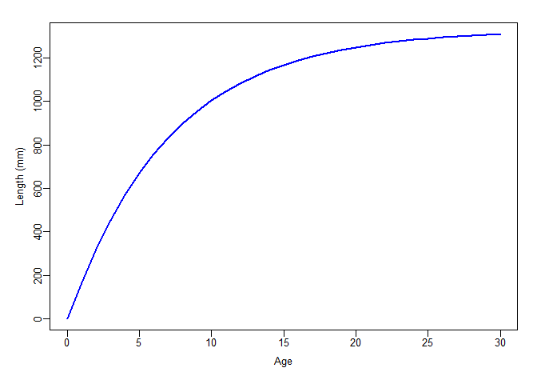

Tutorial for getting Selex function parameters
----------------------------------------------

Written by Henning Winker   <henning.winker@gmail.com>

To add flexibility for exploring alternative assumptions about
selectivity, JABBA-Select provides the user an option to specify a
5-parameter piece-wise dome-shaped selectivity curve, with a logistic
function for the ascending limb and the descending limb described by the
mean and CV of a half-normal distribution [(Huynh et al.,
2018)](https://afspubs.onlinelibrary.wiley.com/doi/full/10.1002/mcf2.10027)

This little tutorial [R
code](https://github.com/jabbamodel/JABBA-Select/blob/master/SELEX_Tutorial/SELEX_Tutorial.rmd)
illustrates how to approximate the 5 parameters for JABBA-Selex function
from various selection-at-length(age) relationships (see also
[`ss2jabba_swnbase.R`](https://github.com/jabbamodel/JABBA-Select/blob/master/SWOss3/ss2jabba_swnbase.R)
for extracting selectivity functions from Stock Synthesis).

To do this, we fit the `jabba.selex()` function to selectivity-at-length
vectors and estimate the five selex input parameters for JABBA-Select,
where `SL50` and `SL95` are the lengths along a logistic ogive where 50%
and 95% of fish are selected, `SL.desc` determines length were right
limb of a dome shaped curve is starting descend as a function of a
half-normal distribution, `CV.desc` is the CV of the half-normal and
thus represents the rate of descent and `min.desc` determines the
minimum height of the descending curve after which it remains constant
(c.f. SS3 SELEX)

    #--------------------------------------
    # JABBA-Selex function
    #--------------------------------------

    jabba.selex <- function(pars,dat){
      L = dat[,1]
      sel = dat[,2]/max(dat[,2])
      SL50  = pars[1]
      SL95  =  pars[2]
      SL.desc =  pars[3]    
      CV.desc   =  pars[4]
      min.desc =     pars[5]
      psel_a = 1/(1+exp(-log(19)*(L-SL50)/(SL95-SL50)))
      psel_b = dnorm(L,SL.desc,CV.desc*SL.desc)/max(dnorm(L,SL.desc,CV.desc*SL.desc))
      psel_c = 1+(min.desc-1)*(psel_b-1)/-1
      psel = ifelse(L<SL.desc,psel_a,psel_c)
      resids = sel-psel
      return(list(ll=sum(resids^2),results=data.frame(L=L,obs=sel,fit=psel,logis=psel_a,halfnorm=psel_b,height=psel_c)))
    }
    # Likelihood
    jsel.ll = function(pars,dat){
      jabba.selex(pars,dat)$ll
    } 

[Punt and Japp
(1994)](https://www.tandfonline.com/doi/pdf/10.2989/025776194784286996)
delevoped a determistic Age-Structured Production Model to conduct an
assessment of South African Kinklip stock. For sensitivity runs they
explored altenative selectivity-at-age functions to model logistic and
dome-shaped selectivity patterns of demersal longline and trawl
fisheries, respectively. The selectivity-at-age of functions are given
Appendix III by the equations AIII.1 and AIII.2 in Punt and Jupp (1994),
which are written in the form of the `selfun()`:

    #------------------------------------------------------------------------
    # Piece-Wise Selectivity Function (Punt & Japp 1994)
    selfun <- function(age,a50,delta,lamda){
      logistic = 1/(1+exp(-(age-a50)/delta))  
      dome = exp(-lamda*(age-a50))*logistic 
      return(ifelse(age<a50,(logistic),(dome)/max(dome))) # selectivity-at-age
    }
    #------------------------------------------------------------------------

Because selectivity is expressed in this case as a function of age, we
first convert age to length using the von Bertalanffy growth parameters
in Punt and Jupp (1994).

    #Growth paramters
    Linf <- 1326
    kappa <- 0.142
    t0 <-  0.05
    age = 0:30
    L_a = Linf*(1-exp(-kappa*(age-t0))) # Vector of expected lengths-at-age
    L_a[1] = 1 # must be non-negative to include Age-0
    # Plot
    par(mfrow=c(1,1),mai=c(0.5,0.45,0,.15),omi = c(0.1,0.1,0.2,0) + 0.1,mgp=c(2,0.5,0), tck = -0.02,cex=0.8)
    plot(age,L_a,ylab="Length (mm)",xlab="Age",type="l",lwd=2,col=4)

The selectivity-at-age paramters are extracted from Table 4 (base case)
and Table 5 (sensitivity runs), where `a50` is the
age-at-50%-selectivity of the ascending logistic function, `delta`
determines the ascending slope and `lamda` the descing slope. If lamda =
0, the dome-shaped function reduces to a logistic.

    # First 3 are logistic functions (lamda = 0) and second 3 dome-shaped
    a50 = c(4.5,5.5,6.5,1.5,2.5,3.5)
    delta = c(0.33,0.33,0.33,0.167,0.167,0.167)
    lamda = c(0,0,0,0.05,0.07,0.09)

Next, a `data.frame()` of `L_a` and the corresponding is generated with
the corresponding selectivity vectors using `selfun()` with the inputs
`age`, `a50`, `delta` and `lamda`.

    selex.dat = data.frame(L_a) # Create data.frame with L_a
    nSel = length(a50) # number of selectivity functions
    for(i in 1:nSel){ 
    Sel = selfun(age,a50[i],delta[i],lamda[i]) 
    selex.dat = data.frame(selex.dat,Sel)
    }
    # Rename Colums
    colnames(selex.dat) = c("L_a",paste0("Sel",1:nSel))

The assumed selectivity-at-age can be plotted by looping through the
selectivity parameters with `selfun()`.

    cols= rainbow(10) 
    plot(0,0,ylim=c(0,1),xlim=range(age),ylab="Selectivity",xlab="Age",type="h")
    for(i in 1:nSel){ 
      lines(age,selfun(age,a50[i],delta[i],lamda[i]),col=cols[2+i])
      points(age,selfun(age,a50[i],delta[i],lamda[i]),pch=16,col=cols[2+i],cex=0.7)
    }

The goal with the `jabba.selex()` function is to estimate the five
parameters that best approximate these selectivity patterns as a
function of length. As common for non-linear models `jabba.selex()`
requires reasonable initial values for the five estimable parameters.

This can be done fairly generically, such that:

    L_a = selex.dat$L_a
    Sel = selex.dat$Sel5 # Choose dome-shaped selectivity

    # check maxima 
    peak = which(max(selex.dat[,i+1])==selex.dat[,i+1])
    # get inits of jabba.selex parameters
    pars = c(SL50   = selex.dat[peak[1],1]*0.8,SL95=selex.dat[peak[1],1]*0.95,SL.desc=selex.dat[max(peak),1],CV.desc=0.2,min.desc=0.001)
    # Show initial values
    pars

    ##     SL50     SL95  SL.desc  CV.desc min.desc 
    ## 455.4065 540.7952 569.2582   0.2000   0.0010

The `jabba.selex()` is fitted to `L_a` and `Sel` using `optim()` based
on the initial starting values `pars`.

    # Fit with optim()
    jsel.est = optim(pars, fn = jsel.ll,method="L-BFGS-B",lower=10^-3,upper=max(selex.dat$L_a*1.1), dat = data.frame(L_a,Sel), hessian = TRUE)
    # Show estimates
    jsel.est$par

    ##        SL50        SL95     SL.desc     CV.desc    min.desc 
    ## 431.6096715 431.9554375 573.2082664   0.7624318   0.0010000

With the following chunk of R code the `jabba.selex()` is fitted to all
6 selectivity functions, the parameter estimates saved and the elements
of piece-wise Selex function are illustrated in color-code plots.

    selex.pars = NULL # Save selex parameters

    # convert ss2jabba.selex
    for(i in 1:nSel){
      
    # check maxima
    peak = which(max(selex.dat[,i+1])==selex.dat[,i+1])
    # get inits of jabba.selex parameters
    pars = c(SL50   = selex.dat[peak[1],1]*0.8,SL95=selex.dat[peak[1],1]*0.95,SL.desc=selex.dat[max(peak),1],CV.desc=0.2,min.desc=0.001)
    # Minimize
    jsel.est = optim(pars, fn = jsel.ll,method="L-BFGS-B",lower=10^-3,upper=max(selex.dat$L_a*1.1), dat = selex.dat[,c(1,i+1)], hessian = TRUE)
    #Results
    jsel.out = jabba.selex(jsel.est$par,dat=selex.dat[,c(1,i+1)])$results 
    # Add selex parameters
    selex.pars = cbind(selex.pars,round(jsel.est$par,4))
      
      
    # Plot
    if(i==1){
    Par = list(mfrow=c(round(nSel/2+0.01,0),ifelse(nSel==1,1,2)),mai=c(0.3,0.15,0,.15),omi = c(0.25,0.25,0.2,0) + 0.1,mgp=c(2,0.5,0), tck = -0.02,cex=0.8)
    par(Par)
      }
    plot(jsel.out$L ,jsel.out$obs,type="p",pch=1,ylab="Selectivity",xlab="Length")
      lines(jsel.out$L,jsel.out$logis,lwd=2,col=4)
      if(jsel.est$par[3]<0.98*max(jsel.out$L))lines(jsel.out$L,jsel.out$halfnorm,lwd=2,col=3)
      if(jsel.est$par[3]<0.98*max(jsel.out$L)) lines(jsel.out$L,jsel.out$height,lwd=2,col=7)
      lines(jsel.out$L,jsel.out$fit,lwd=2,col=2)
      if(i==1)legend("right",c("Data","Fit","Logistic","Half-Normal","Height"),pch=c(1,rep(-1,4)),lwd=c(-1,rep(2,4)),col=c(1,2,4,3,7),cex=0.8,bty="n")
      if(i == nSel){
        mtext(paste("Length"), side=1, outer=TRUE, at=0.5,line=1,cex=1)
        mtext(paste("Selectivity"), side=2, outer=TRUE, at=0.5,line=1,cex=1)
        
      }
      
    } # End of selectivity loop

The final step is format and save the `selex` input .csv file - in this
case for a JABBA-Select Kingklip (KKPL).

      colnames(selex.pars) = paste0("S",1:nSel)
      write.csv(selex.pars,"SELEX_KKLP.csv",row.names = F)

      selex.pars

    ##                 S1        S2        S3       S4       S5       S6
    ## SL50      619.2675  712.8228  793.9960 256.5742 340.5359 497.0443
    ## SL95      716.4167  797.1127  867.1263 304.6840 360.0237 539.4668
    ## SL.desc  1263.9137 1253.4428 1253.2326 320.7191 577.5456 613.5101
    ## CV.desc    64.9498    1.7452   41.0137   2.2040   0.7513   0.6100
    ## min.desc    9.0670    0.9636    6.1942   0.0010   0.0010   0.0010
